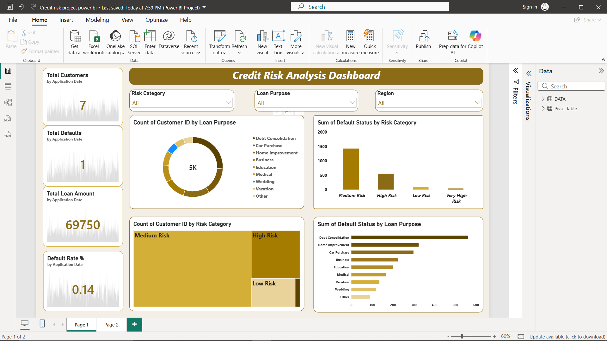

# Credit Risk Analysis Dashboard

## 📌 Project Overview

This project focuses on analyzing customer credit risk and identifying factors associated with loan defaults. The analysis uses Excel for data preparation and validation, and Power BI to create an interactive Credit Risk Analysis Dashboard.

The dashboard helps users understand customer risk categories, loan purposes, default patterns, and key lending indicators.

---

## 🎯 Business Problem

Financial institutions need to identify high-risk borrowers and understand the factors that contribute to loan defaults.

This project aims to:

- Analyze customer credit risk
- Identify default patterns across risk categories
- Compare defaults by loan purpose
- Analyze customer and loan characteristics
- Provide an interactive dashboard for risk monitoring
- Support data-driven lending decisions

---

## 🛠️ Tools & Skills

- **Microsoft Excel**
  - Data cleaning
  - Data validation
  - Data quality checks
  - Exploratory analysis

- **Power BI**
  - Data modeling
  - DAX measures
  - Interactive dashboards
  - KPI analysis
  - Slicers and filters
  - Data visualization

---

## 📊 Dataset

The dataset contains **5,000 customer loan records**.

Key variables include:

- Credit Score
- Annual Income
- Debt-to-Income Ratio (DTI)
- Loan Amount
- Interest Rate
- Credit Utilization
- Late Payments
- Delinquencies
- Previous Loans
- Number of Credit Cards
- Loan Purpose
- Risk Category
- Default Status
- Region
- Application Date

---

## 🔍 Analysis Performed

### 1. Data Quality Analysis

Performed data quality checks to identify:

- Missing values
- Invalid values
- Range issues
- Duplicate records
- Category consistency
- Numeric field validation

### 2. Credit Risk Analysis

Analyzed relationships between:

- Credit Score and Default Status
- DTI and Default Risk
- Loan Amount and Default Status
- Interest Rate and Risk
- Credit Utilization and Risk
- Late Payments and Defaults
- Previous Loans and Risk

### 3. Loan Purpose Analysis

Compared customer loan volumes and default patterns across:

- Debt Consolidation
- Home Improvement
- Car Purchase
- Business
- Education
- Medical
- Vacation
- Wedding
- Other

---

## 📈 Power BI Dashboard

The dashboard provides:

- Total Customers
- Total Defaults
- Total Loan Amount
- Default Rate
- Customer distribution by Risk Category
- Customer distribution by Loan Purpose
- Defaults by Risk Category
- Defaults by Loan Purpose
- Interactive filtering by:
  - Risk Category
  - Loan Purpose
  - Region

### Dashboard Preview



---

## 💡 Key Business Insights

The dashboard enables users to:

- Identify customer segments with higher credit risk
- Monitor default patterns across loan purposes
- Compare risk categories
- Understand the relationship between borrower characteristics and defaults
- Support credit-risk monitoring and lending decisions

---

## 📁 Project Structure

```text
Credit-Risk-Analysis/
│
├── Credit_Risk_Dataset.xlsx
├── Credit_Risk_Dashboard.pbix
├── dashboard.png
└── README.md
